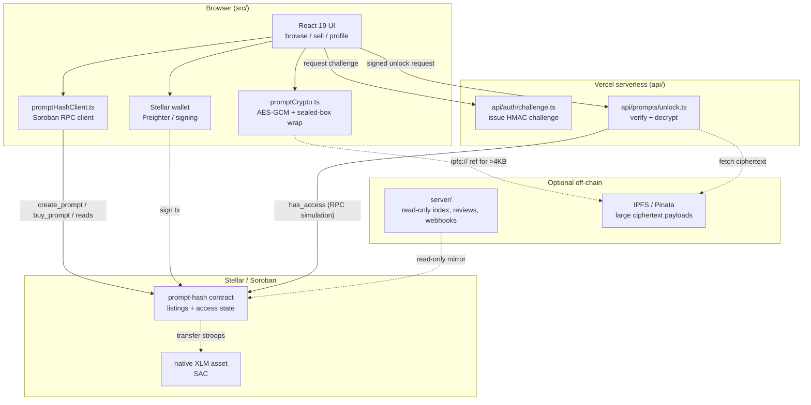
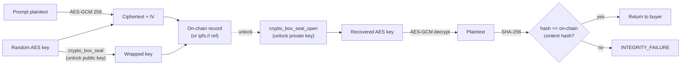
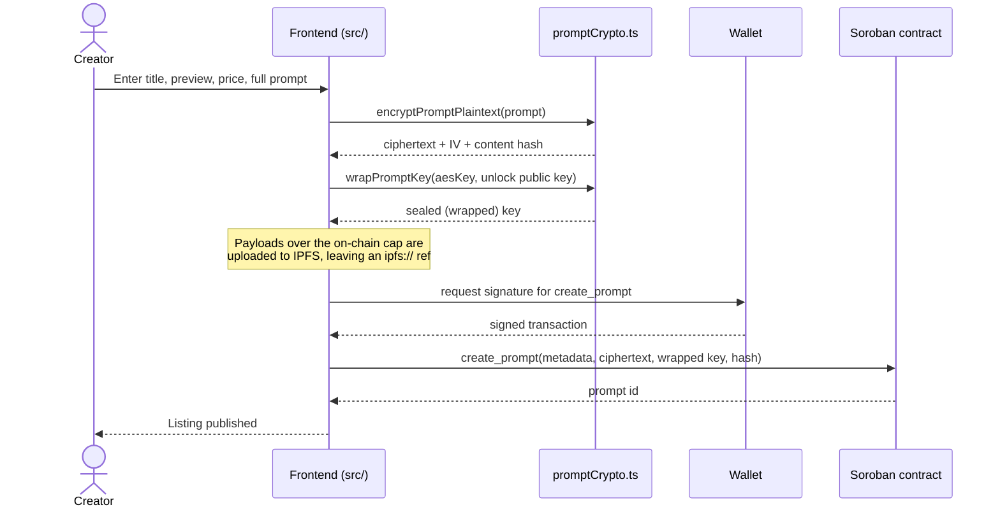
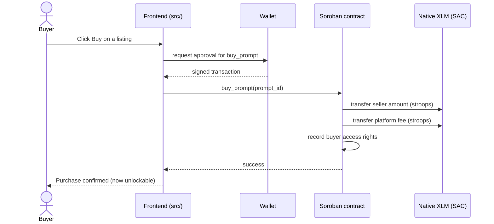
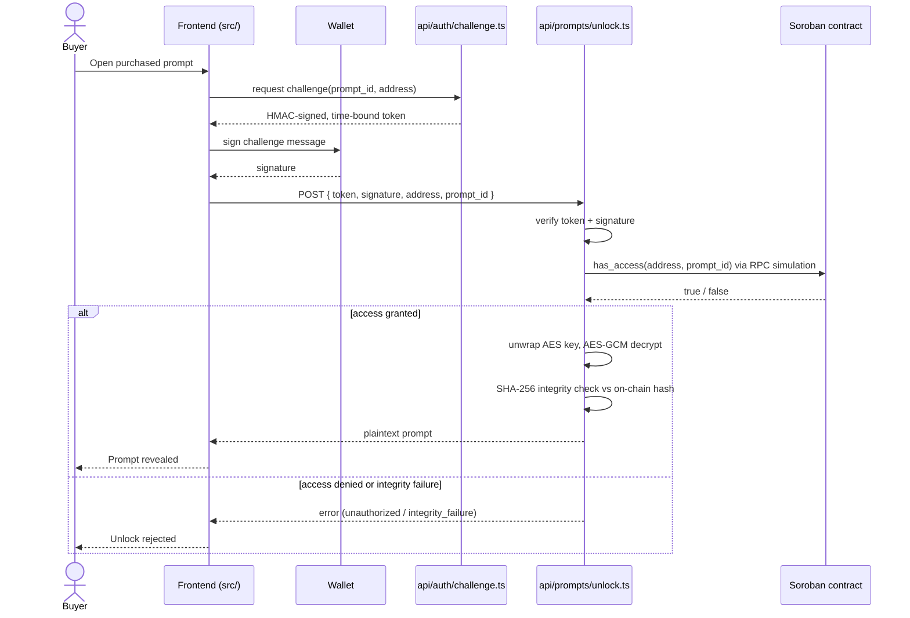

# PromptHash Stellar — End-to-End Architecture

This guide is the visual companion to [architecture.md](./architecture.md). It
diagrams how the four moving parts of PromptHash Stellar fit together and walks
through the three core flows — **listing**, **purchase**, and **unlock** — at the
message level.

The diagrams below are written in [Mermaid](https://mermaid.js.org/) and render
inline on GitHub.

## Contents

- [System overview](#system-overview)
- [Component responsibilities](#component-responsibilities)
- [Encryption and wallet verification model](#encryption-and-wallet-verification-model)
- [Flow 1 — Listing a prompt](#flow-1--listing-a-prompt)
- [Flow 2 — Purchasing access](#flow-2--purchasing-access)
- [Flow 3 — Unlocking a purchased prompt](#flow-3--unlocking-a-purchased-prompt)
- [Environment variables](#environment-variables)

## System overview

The smart contract is the single source of truth for ownership and access
rights. The frontend, the serverless unlock service, and the optional Express
indexer all defer to it.

## Component responsibilities

| Layer | Path | Responsibility |
|-------|------|----------------|
| Frontend | `src/` | Wallet connection, client-side encryption, marketplace browsing, listing management, unlock initiation |
| Soroban contract | `contracts/prompt-hash` | Authoritative ownership, purchase rights, payment routing, fee config |
| Unlock / auth service | `api/auth/challenge.ts`, `api/prompts/unlock.ts` | Mint challenge tokens, verify wallet signatures, check on-chain access, decrypt and integrity-check plaintext |
| Off-chain indexer | `server/` | Read-only indexing, preview analytics, reviews, webhook dispatch (never writes access state) |
| Off-chain storage | IPFS / Pinata | Optional store for encrypted payloads larger than the on-chain cap |

The contract is the **only** component permitted to grant, revoke, or modify
access. The unlock service trusts `has_access`, not any database.

## Encryption and wallet verification model

Two independent cryptographic guarantees protect a prompt:

1. **Confidentiality** — the plaintext is encrypted in the browser and can only
   be recovered by the unlock service's private key.
2. **Authorization** — plaintext is only released to a wallet that both proves
   key ownership (signature) and holds on-chain access (`has_access`).

Key facts (see `src/lib/crypto/promptCrypto.ts` and `api/prompts/unlock.ts`):

- Prompt bodies use **AES-GCM 256** with a per-prompt random key and IV.
- The AES key is wrapped with a libsodium **sealed box** (`crypto_box_seal`)
  against `PUBLIC_UNLOCK_PUBLIC_KEY`; only `UNLOCK_PRIVATE_KEY` can unwrap it.
- After decrypting, the service recomputes a **SHA-256** content hash and
  compares it with the hash stored on-chain, rejecting tampered payloads.
- Wallet verification is a **challenge-response**: the service issues a
  short-lived HMAC token (`CHALLENGE_TOKEN_SECRET`), the wallet signs it, and
  the unlock endpoint verifies the signature before reading access state.

## Flow 1 — Listing a prompt

## Flow 2 — Purchasing access

## Flow 3 — Unlocking a purchased prompt

## Environment variables

The full template lives in [`.env.example`](../.env.example) (testnet defaults)
and [`env.mainnet.example`](../env.mainnet.example) (mainnet). Variables
prefixed `PUBLIC_` are exposed to the browser; the rest are server-only and must
never be committed.

### Frontend and shared

| Variable | Scope | Purpose |
|----------|-------|---------|
| `PUBLIC_STELLAR_NETWORK` | Frontend | Active network (`TESTNET` / `PUBLIC` / `FUTURENET`); drives the testnet badge |
| `PUBLIC_STELLAR_NETWORK_PASSPHRASE` | Frontend | Network passphrase used when signing transactions |
| `PUBLIC_STELLAR_RPC_URL` | Frontend | Soroban RPC endpoint |
| `PUBLIC_STELLAR_HORIZON_URL` | Frontend | Horizon endpoint for account and asset queries |
| `PUBLIC_PROMPT_HASH_CONTRACT_ID` | Frontend + server | Deployed prompt-hash contract id |
| `PUBLIC_STELLAR_NATIVE_ASSET_CONTRACT_ID` | Frontend + server | Native XLM Stellar Asset Contract id |
| `PUBLIC_STELLAR_SIMULATION_ACCOUNT` | Frontend + server | Account used for read-only RPC simulation (e.g. `has_access`) |
| `PUBLIC_UNLOCK_PUBLIC_KEY` | Frontend | Public key the browser wraps AES keys against |
| `PUBLIC_CHAT_API_BASE` | Frontend (optional) | External chat gateway used by the UI |
| `PUBLIC_PINATA_JWT` | Frontend (optional) | Upload-scoped Pinata JWT for off-chain ciphertext storage |
| `PUBLIC_SENTRY_DSN` | Frontend (optional) | Browser error capture |

### Unlock / auth service (server-only)

| Variable | Purpose |
|----------|---------|
| `CHALLENGE_TOKEN_SECRET` | HMAC secret for signing challenge tokens |
| `UNLOCK_PUBLIC_KEY` | Public half of the unlock key pair |
| `UNLOCK_PRIVATE_KEY` | Private key that unwraps AES keys and decrypts prompts (keep secret) |
| `PINATA_GATEWAY` | Optional IPFS gateway used to fetch off-chain ciphertext |
| `REDIS_URL` | Optional distributed rate-limit backing store (falls back to in-memory) |
| `SENTRY_DSN`, `SENTRY_TRACES_SAMPLE_RATE` | Optional backend error monitoring |

### Optional secret rotation

| Variable | Purpose |
|----------|---------|
| `ADMIN_ROTATION_TOKEN` | Authorizes rotation operations |
| `CHALLENGE_TOKEN_SECRET_PREVIOUS` | Previous HMAC secret accepted during the grace window |
| `CHALLENGE_TOKEN_ROTATION_TIMESTAMP` | When rotation began (ms) |
| `CHALLENGE_TOKEN_GRACE_PERIOD_MS` | How long the previous secret stays valid (default `300000`) |

See [docs/secret-rotation.md](./secret-rotation.md) for the rotation runbook and
[docs/environments.md](./environments.md) for per-environment setup.
