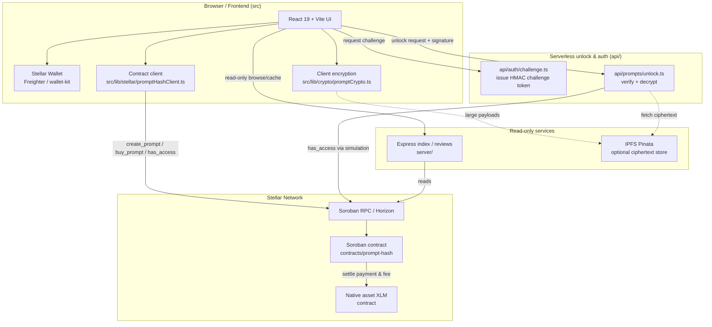
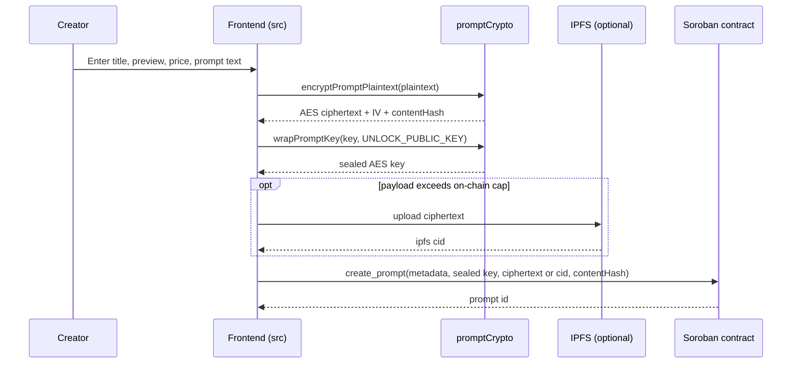
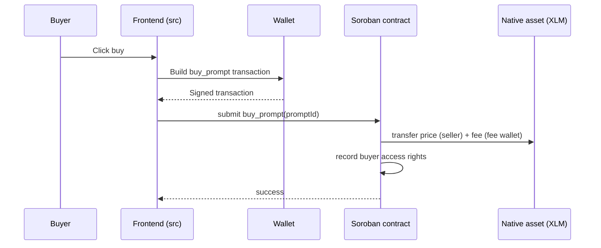
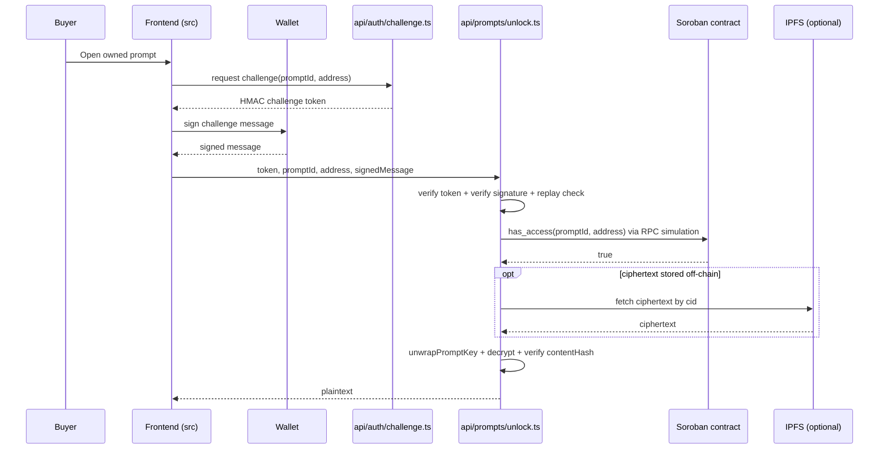

# End-to-End Architecture Overview

This guide explains how PromptHash Stellar fits together from end to end: the
frontend application, the Soroban smart contract, the serverless unlock/auth
service, the encryption scheme, and the wallet-verification flow. It is written
for new contributors who want a single map of the system before diving into the
code.

For a shorter, component-by-component reference see
[`architecture.md`](./architecture.md). For step-by-step user journeys with the
exact components involved see
[`product-journeys.md`](./product-journeys.md).

## Table of contents

- [Design principle](#design-principle)
- [System diagram](#system-diagram)
- [Components](#components)
- [Encryption model](#encryption-model)
- [Wallet verification flow](#wallet-verification-flow)
- [Flow: Listing a prompt](#flow-listing-a-prompt)
- [Flow: Purchasing a prompt](#flow-purchasing-a-prompt)
- [Flow: Unlocking a purchased prompt](#flow-unlocking-a-purchased-prompt)
- [Environment variables](#environment-variables)
- [Trust boundaries](#trust-boundaries)

## Design principle

The Soroban smart contract is the **single source of truth** for prompt
ownership, purchase records, and access rights. No off-chain component may
grant, revoke, or modify access. The unlock service only releases plaintext
*after* both of the following are proven:

1. The caller controls the wallet (a signed challenge), and
2. The contract reports that wallet has access (`has_access` via RPC
   simulation).

Off-chain systems (the index, caches, analytics, webhooks) are read-only
projections of on-chain state.

## System diagram



If the diagram above does not render (some Markdown viewers do not support
Mermaid), here is the same picture in plain text:

```
Browser (React UI, wallet, client crypto, contract client)
   |  create/buy/has_access            request challenge / unlock + signature
   v                                    v
Soroban RPC ---> prompt-hash contract   Serverless unlock & auth (api/)
                    |  settle XLM           |  verify signature
                    v                        |  call has_access (RPC sim)
              Native asset contract          |  decrypt + integrity check
                                             v
                                   plaintext returned to buyer
Read-only index (server/) and optional IPFS (Pinata) sit alongside,
never originating on-chain state changes.
```

## Components

### Frontend application (`src`)

React 19 + TypeScript + Vite. Responsibilities:

- Wallet connection and transaction signing.
- Client-side encryption before a listing is submitted.
- Marketplace browsing, filtering, and creator dashboards.
- Initiating contract-backed purchases.
- Requesting challenge tokens and unlock decryptions for owned prompts.

Key modules:

- `src/lib/stellar/promptHashClient.ts` - typed wrappers over contract methods.
- `src/lib/crypto/promptCrypto.ts` - encryption, key wrapping, content hashing.
- `src/lib/auth/challenge.ts` - challenge message building and signature checks.
- `src/pages/sell/CreatePromptForm.tsx` - listing creation.
- `src/pages/browse/PromptModal.tsx` - purchase and unlock UI.

### Soroban contract (`contracts/prompt-hash`)

The authoritative state layer. It stores listing records and encrypted prompt
references, tracks creator-owned listings and buyer purchase rights, routes XLM
payments and platform fees, and exposes read methods for marketplace views.

Core methods: `create_prompt`, `buy_prompt`, `has_access`, `get_prompt`,
`get_all_prompts`, `get_prompts_by_creator`, `get_prompts_by_buyer`,
`update_prompt_price`, `set_prompt_sale_status`, `transfer_license`,
`set_fee_percentage`, `set_fee_wallet`.

### Unlock / auth service (`api/`)

Vercel serverless functions:

- `api/auth/challenge.ts` issues HMAC-signed, time-bound challenge tokens.
- `api/prompts/unlock.ts` verifies the challenge token and wallet signature,
  confirms `has_access` on-chain, unwraps the AES key, decrypts the prompt, and
  validates the content hash before returning plaintext.

The service is hardened with rate limiting, replay protection, structured
logging, and metrics (`src/lib/observability/*`).

### Read-only services (`server/`) and IPFS

The Express workspace provides indexing, preview analytics, review storage, and
webhook dispatch. It is forbidden from originating prompt state changes. When
`PUBLIC_PINATA_JWT` is set, large ciphertext payloads are stored on IPFS and
only an `ipfs://<cid>` reference is written on-chain (working around the on-chain
size cap).

## Encryption model

PromptHash uses a hybrid scheme so that prompt plaintext is never readable
on-chain and only the unlock service can recover the symmetric key.

- **Content encryption**: the prompt plaintext is encrypted with **AES-256-GCM**
  using a freshly generated key and a random 12-byte IV
  (`encryptPromptPlaintext`).
- **Key wrapping**: the AES key is sealed with a **libsodium sealed box**
  (`crypto_box_seal`) against the unlock service public key (`wrapPromptKey`).
  Only the holder of the matching private key can open it.
- **Integrity**: a **SHA-256** hash of the plaintext (`contentHash`) is stored so
  the unlock service can verify the decrypted result has not been tampered with.

Because the key is sealed to the service public key, the contract and the
browser cannot read prompt content; only the unlock service, after proving the
caller has access, can unwrap the key and decrypt.

## Wallet verification flow

Unlock requests must prove the caller controls the buyer wallet. This is a
challenge-response:

1. The frontend asks `api/auth/challenge.ts` for a token scoped to a prompt and
   wallet address. The token is HMAC-signed and time-bound.
2. The wallet signs the challenge message (`buildChallengeMessage`).
3. `api/prompts/unlock.ts` verifies the token (`verifyChallengeToken`), verifies
   the signature against the address (`verifyChallengeSignature`), and rejects
   replays via a nonce ledger.
4. Only then does it call `has_access` on-chain and proceed to decrypt.

## Flow: Listing a prompt



1. The creator enters title, preview, category, image URL, price, and the full
   prompt text.
2. The browser encrypts the plaintext with AES-256-GCM and computes its SHA-256
   hash.
3. The browser seals the AES key to the unlock service public key.
4. For large payloads, ciphertext is uploaded to IPFS and only the reference is
   kept on-chain.
5. The app submits `create_prompt` with the encrypted payload (or reference),
   sealed key, content hash, and listing metadata.

## Flow: Purchasing a prompt



1. The buyer approves the native asset spend.
2. The app submits `buy_prompt`.
3. The contract moves the seller amount and platform fee (in stroops).
4. The contract records purchase rights for the buyer - this is what
   `has_access` will later report.

## Flow: Unlocking a purchased prompt



1. The buyer requests a challenge token for a specific prompt.
2. The wallet signs the challenge message.
3. The unlock endpoint verifies the token, the signature, and rejects replays.
4. It confirms `has_access` on-chain via RPC simulation.
5. It unwraps the AES key with the service private key, decrypts the ciphertext
   (fetched from IPFS when stored off-chain), validates the SHA-256 content
   hash, and returns the plaintext to the buyer.

## Environment variables

Copy `.env.example` to `.env` for development, or `env.mainnet.example` for a
mainnet deployment. Variables prefixed with `PUBLIC_` are exposed to the browser
at build time; the rest are server-only secrets and must never be shipped to the
client.

### Frontend / network (browser-exposed)

| Variable | Purpose |
|----------|---------|
| `PUBLIC_STELLAR_NETWORK` | Active network: `TESTNET`, `PUBLIC` (mainnet), or `FUTURENET`. Drives the in-app network badge. |
| `PUBLIC_STELLAR_NETWORK_PASSPHRASE` | Network passphrase used when building transactions. |
| `PUBLIC_STELLAR_RPC_URL` | Soroban RPC endpoint for contract calls and simulation. |
| `PUBLIC_STELLAR_HORIZON_URL` | Horizon endpoint for account and payment data. |
| `PUBLIC_PROMPT_HASH_CONTRACT_ID` | Deployed `prompt-hash` contract ID. |
| `PUBLIC_STELLAR_NATIVE_ASSET_CONTRACT_ID` | Native asset (XLM) contract ID used to settle purchases. |
| `PUBLIC_STELLAR_SIMULATION_ACCOUNT` | Account used for read-only RPC simulation (e.g. `has_access`). |
| `PUBLIC_UNLOCK_PUBLIC_KEY` | Unlock service public key the browser seals AES keys to. |
| `PUBLIC_CHAT_API_BASE` | Optional external chat gateway used by the UI. |
| `PUBLIC_PINATA_JWT` | Optional upload-scoped Pinata JWT; when set, ciphertext is stored on IPFS and only the reference goes on-chain. |

### Unlock service (server-only secrets)

| Variable | Purpose |
|----------|---------|
| `CHALLENGE_TOKEN_SECRET` | HMAC secret for signing/verifying challenge tokens. |
| `UNLOCK_PUBLIC_KEY` | Public key half of the unlock keypair. |
| `UNLOCK_PRIVATE_KEY` | Private key used to unwrap sealed AES keys and decrypt. Must remain secret. |

### Optional operational settings

| Variable | Purpose |
|----------|---------|
| `STELLAR_SCAFFOLD_ENV` | Scaffold environment hint (`development` / `production`). |
| `XDG_CONFIG_HOME` | Config home used by Stellar tooling. |
| `REDIS_URL` | Backing store for distributed rate limiting (recommended in production). |
| `PINATA_GATEWAY` | IPFS gateway the unlock service uses to fetch off-chain ciphertext. |
| `ADMIN_ROTATION_TOKEN` | Authorizes the secret-rotation endpoint. |
| `CHALLENGE_TOKEN_SECRET_PREVIOUS` | Previous challenge secret accepted during a rotation grace period. |
| `CHALLENGE_TOKEN_ROTATION_TIMESTAMP` | Start time (ms) of the active rotation window. |
| `CHALLENGE_TOKEN_GRACE_PERIOD_MS` | How long the previous secret stays valid after rotation. |

See [`secret-rotation.md`](./secret-rotation.md) for the rotation procedure and
[`environments.md`](./environments.md) for per-environment setup.

## Trust boundaries

| Boundary | What it guarantees |
|----------|--------------------|
| Browser to contract | All state changes (create, buy, transfer) are signed by the user's wallet and validated by the contract. |
| Contract as source of truth | Access rights live only on-chain; off-chain services cannot grant or revoke them. |
| Wallet challenge to unlock | Plaintext is released only after a signed challenge proves wallet control. |
| Sealed key to unlock service | Only the service private key can unwrap the AES key, so neither the chain nor the browser can read prompt content. |

Key operational assumptions: keep `UNLOCK_PRIVATE_KEY` and
`CHALLENGE_TOKEN_SECRET` secret, rotate them per
[`secret-rotation.md`](./secret-rotation.md), and configure contract IDs and
network settings correctly per environment.
